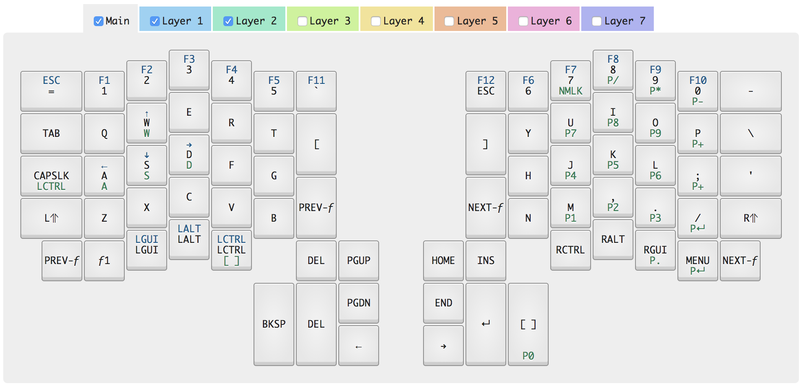

Ergojack
========

My Ergodox Infinity layout. Includes DFU bins, and a json file for use with
Input Club Configurator ([website](https://input.club/configurator/) /
[github](https://github.com/kiibohd/KiiConf)).

Considerations
--------------

I had two goals when designing this layout - I'll be using this for work, where
where as a programmer I'll spend half my life on this keyboard; and for gaming,
where I'll spend some of the other half. I play a variety of games, including
FPSes like Overwatch and Space sims, like Star Citizen.

### Why Ergodox

An Ergodox is a pretty natural fit for all of these tasks; the ergonomic nature
lends itself to spending many hours typing; a compact, left-hand keyboard is
all that's really necessary for most FPS games (other than trash talking in
chat - although a left-hand board DOES give you "gg", which is really all
anyone needs, right?); and finally, the thing that sent me overboard, is that
an Ergodox can surround both sides of a centered Joystick for space/flight sims.
It looks _really good_ with a HOTAS setup.

After an Ergodox and keycaps ordered on Massdrop
([devtty](https://www.massdrop.com/buy/massdrop-x-matt3o-devtty-custom-keycap-set?utm_source=linkshare&referer=CECUZJ)
and [carbon](https://www.massdrop.com/buy/carbon?utm_source=linkshare&referer=CECUZJ)),
it arrived, assembled quickly, and it was layout time.

### Why This Layout In Particular

I made a handful of differences from traditional keyboards, and a few more from
the default Ergodox Layout. The first major deviation I made from traditional
keyboard layouts, and especially from Mac keyboards, is to move the ctrl keys to
the thumbs. I find it much more comfortable to mash "ctrl-c" and "ctrl-d" this
way; it's absolutely miserable on a Mac keyboard without this switch, unless you
remap capslock (which I did, but I always forget about.)

I kept the left hand to "negative" actions - lower current layer, backspace,
delete. The right hand is "positive" actions - raise layer, space, enter.
Having some kind of organization helps me remember the new layout.

I a temporary "fn" key, which switches the keyboard to layer one, in the bottom
left; holding that allows me to use WASD as arrow keys, which otherwise don't
exist.

Lastly, when in layer two, you're in gaming mode; left ctrl, at my thumb's
natural resting position, becomes space; while capslock becomes control. That
makes running, jumping, etc as natural as any other keyboard. It also swaps
the top left "=" for an ESC button.

I'm too chicken to swap to Dvorak or Colemak or Workman or something quite yet.
Maybe someday.

